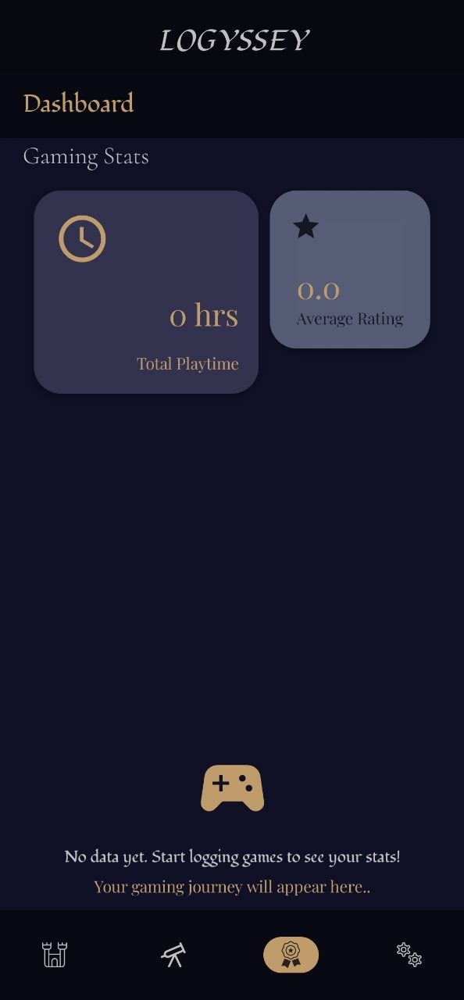
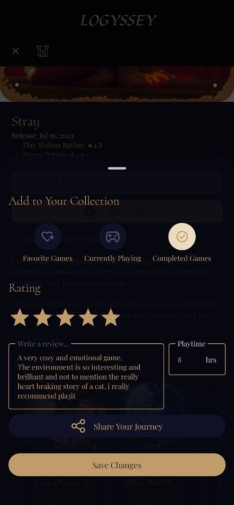

# Logyssey🎮

Logyssey is a modern, multilingual gaming discovery platform and personal companion app for Android. Designed for gamers who want to track their journeys, it features a comprehensive data dashboard tracking playtime statistics, custom user reviews, and game exploration features.
Built entirely with modern Android development patterns, the application showcases smooth UI layouts, local data persistence, dynamic theme management, and full multi-language localization.

---

##  Screenshots

| Gaming Dashboard | Discovery Hub | Review System |
| --- | --- | --- |
|  |   | |

---

## Features

- **Personal Gaming Dashboard:** Track comprehensive gaming metrics at a glance, including total time played, average title ratings, and personalized user progress lists.
- **Multilingual Support:** Fully localized interface supporting multiple languages seamlessly via standard Android localization practices.
- **Dynamic Theme Toggling:** Supports native Light and Dark modes (`LogysseyTheme`), adapting flawlessly to user preferences.
- **Review & Rating System:** Allows users to write detailed text reviews and assign numerical ratings to cataloged games.
- **Advanced UI Layouts:** Implements scrolling behaviors, including `stickyHeader` groupings for lists, ensuring a smooth and responsive user experience.

---

## Tech Stack & Architecture

- **Language:** Kotlin
- **UI Framework:** Jetpack Compose (Declarative UI, State Management)
- **Design Pattern:** MVVM (Model-View-ViewModel) for clean separation of concerns
- **Theme Engine:** Material Design 3 (Compose Material3)
- **Asynchrony:** Kotlin Coroutines & Flow

---

